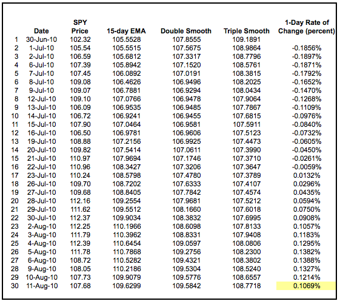

# 03.TRIX
* [TRIX](http://stockcharts.com/school/doku.php?id=chart_school:technical_indicators:trix)

## Introduction
* TRIX is a momentum oscillator that displays the percent rate of change of a triple exponentially smoothed moving average. It was developed in the early 1980's by Jack Hutson, an editor for Technical Analysis of Stocks and Commodities magazine. With its triple smoothing, TRIX is designed to filter insignificant price movements. Chartists can use TRIX to generate signals similar to MACD. A signal line can be applied to look for signal line crossovers. A directional bias can be determined with the absolute level. Bullish and bearish divergences can be used to anticipate reversals.

* Trix是一个动量振荡器，它显示三重指数平滑移动平均的百分比变化率。它是由“股票与商品技术分析”杂志的编辑杰克·哈特森在1980年代初开发的。TRIX的三重平滑功能旨在过滤微不足道的价格波动。CHARMER可以使用TRIX来产生类似MACD的信号。信号线可应用于寻找信号线交叉器。方向偏置可以用绝对电平来确定。看涨和看跌分歧可以用来预测反转。

## Calculation
* TRIX is the 1-period percentage rate-of-change for a triple smoothed exponential moving average (EMA), which is an EMA of an EMA of an EMA. Here is a breakdown of the steps involved for a 15 period TRIX.

* Trix是三次平滑指数移动平均(EMA)的一个周期变化率，它是EMA的EMA。以下是15期TRIX所涉步骤的细目。

1. Single-Smoothed EMA = 15-period EMA of the closing price
2. Double-Smoothed EMA = 15-period EMA of Single-Smoothed EMA
3. Triple-Smoothed EMA = 15-period EMA of Double-Smoothed EMA
4. TRIX = 1-period percent change in Triple-Smoothed EMA

* The table and chart below provide examples for the 15-day EMA, double-smoothed EMA and triple-smoothed EMA. Notice how each EMA lags price a little more. Even though exponential moving averages put more weight on recent data, they still contain past data that produces a lag. This lag increases with each smoothing.

* 下表和图表提供了15天均线、双平滑均线和三平顺均线的例子。注意每个EMA是如何延迟价格的。尽管指数移动平均法对最近的数据给予了更多的权重，但它们仍然包含了产生滞后的过去数据。这种滞后随平滑度的增加而增加。

* The blue line is the price plot for SPY. It is clearly the most jagged (volatile) of the four lines. The red line is the 15-day EMA, which follows the price plot the closest. The green line is the double-smoothed EMA and the purple line is the triple-smoothed EMA. Notice how these two lines turn flatter as the lag increases.

* 蓝线是SYP的价格。这显然是这四条线中最锯齿状的(不稳定)。红线是15天均线，这是最接近的价格图。绿线是双平滑的EMA，紫色的是三次平滑的EMA.注意这两行是如何随着滞后的增加而变得更加平缓。

* TRIX is negative as long as the triple-smoothed 15-day EMA is moving lower. TRIX turns positive when the triple-smoothed 15-day EMA turns up. The extra smoothing ensures that upturns and downturns are kept to a minimum. In other words, it takes more than a one-day advance to reverse a downtrend.

* 只要三线平滑的15天均线走低，Trix就为负数.当三倍平滑的15天均线出现时，Trix变成正数。额外的平滑确保上下波动保持在最小。换句话说，要扭转下跌趋势，需要一天以上的时间。

## Interpretation
* TRIX (15,9) is quite similar to MACD (12,26,9). Both are momentum oscillators that fluctuate above and below the zero line. Both have signal lines based on a 9-day EMA. Most notably, both lines have similar shapes, signal line crossovers, and centerline crosses. The biggest difference between TRIX and MACD is that TRIX is smoother than MACD. The TRIX lines are less jagged and tend to turn a bit later.

* TRIX (15,9) 和 MACD (12,26,9)很相似，两者都是在零线上下波动的动量振子。两家公司都有基于9天均线的信号线。最值得注意的是，这两条线都有相似的形状，信号线交叉和中心线交叉。TRIX与MACD最大的区别在于TRIX比MACD更平滑。TRIX线不那么锯齿状，而且倾向于稍晚一点转向。

