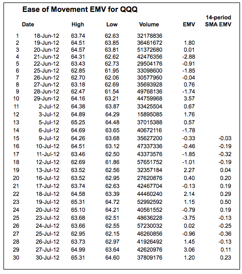
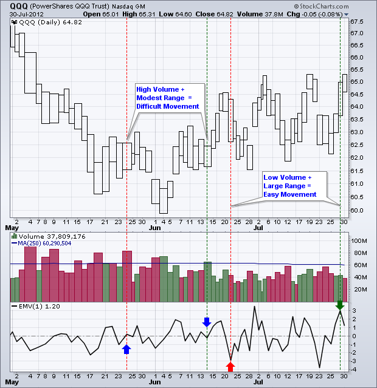
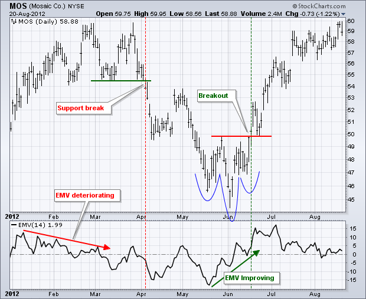
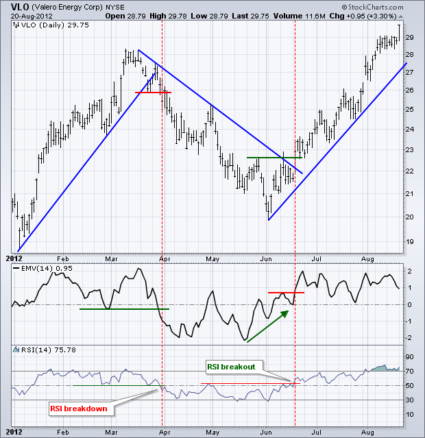

# 04.Ease of Movement（EMV）
* [Ease of Movement（EMV）](http://stockcharts.com/school/doku.php?id=chart_school:technical_indicators:ease_of_movement_emv)

## Introduction
* Developed by Richard Arms, Ease of Movement (EMV) is a volume-based oscillator that fluctuates above and below the zero line. As its name implies, it is designed to measure the “ease” of price movement. Arms created Equivolume charts to visually display price ranges and volume. Ease of Movement takes Equivolume to the next level by quantifying the price/volume relationship and showing the results as an oscillator. In general, prices are advancing with relative ease when the oscillator is in positive territory. Conversely, prices are declining with relative ease when the oscillator is in negative territory.

* 由理查德昂斯，EMV是一个以成交量为基础的振荡器，波动在零线以上和之下。顾名思义，它的设计是为了衡量价格变动的“舒适度”。昂斯创造了等量图表，以直观地显示价格范围和数量。通过量化价格/成交量的关系，并将结果显示为一个振荡器，易移动将等量提升到下一个水平。一般来说，当振子处于正向区域时，价格相对容易上涨。相反，当振荡器处于负区间时，价格相对容易下降。

## SharpCharts Calculation
* There are three parts to the EMV formula: distance moved, volume and the high-low range. First, the distance moved is calculated by comparing the current period's midpoint with the prior period's midpoint, which is the high plus the low divided by two. Distance moved is positive when the current midpoint is above the prior midpoint and negative when the current midpoint is below the prior midpoint. Distance moved is shown as the numerator in the formula below.

* EMV公式分为三个部分：距离移动、成交量和最高价-最低价范围。首先，通过比较当前周期的中点和前期的中点，即最高价加最低价除以2，计算出移动距离。当当前中点高于前中点时，移动距离为正；当当前中点低于前中点时，移动距离为负。移动距离在下面的公式中显示为分子。

> Distance Moved = ((H + L)/2 - (Prior H + Prior L)/2) Box Ratio = ((V/100,000,000)/(H - L)) 1-Period EMV = ((H + L)/2 - (Prior H + Prior L)/2) / ((V/100,000,000)/(H - L)) 14-Period Ease of Movement = 14-Period simple moving average of 1-period EMV 

* The other two parts form the Box ratio, which uses volume and the high-low range. Equivolume charts are based on volume and the high-low range as well. The Box ratio is the denominator of EMV. Note that volume is divided by 100,000,000 to keep it relevant with the other numbers.

* 另外两个部分组成了盒比，它使用体积和高-低范围。等量图是基于卷和高-低范围以及。箱比是EMV的分母。注意，卷除以100，000，000，以保持它与其他数字相关。

* Relatively low volume and a relatively large high-low range will produce a smaller denominator (Box ratio), which means the EMV value will be larger because of division by a smaller number. The Box ratio would be .50 if V/10000000 equals 2 and the high-low range equals 4. A wide range on low volume implies relatively easy price movement. In other words, it did not take much volume to move prices.

* 相对较低的体积和较大的高-低量程将产生较小的分母(箱比)，这意味着EMV值会因为除以较小的数目而增大。如果V/10000000等于2，高-低范围等于4，则盒比为0.50。低成交量的范围很广，意味着价格变动相对容易。换句话说，价格的变动并不需要太多的量。

* A relatively small high-low range on high volume would produce a larger denominator, which means the EMV value will be smaller. The denominator would be 2 if V/10000000 equals 4 and the high-low range equals 2. This implies that price movement was difficult because there was a relatively small high-low range on big volume.

* 在高体积上，相对较小的高-低范围将产生更大的分母，这意味着EMV值将更小。如果V/10000000等于4，高-低范围等于2，则分母为2。这意味着价格变动是困难的，因为在大成交量上有一个相对较小的高-低区间。

## Interpretation
* The example below shows the Nasdaq 100 ETF (QQQ) with the 1-period EMV in the lower indicator window. I am using Equivolume bars because these show only the high-low range for the given period. The blue arrows show two small EMV values. One is slightly positive and the other is slightly negative. Volume on both days was above average, but the high-low range was modest or even small. This means prices had difficulty moving even though volume was relatively high.

* 下面的示例显示了纳斯达克100ETF(QQQ)，其在下指示窗口中具有1周期EMV。 我正在使用等体积块，因为它们仅显示给定时段的高-低范围。蓝色箭头显示两个小的EMV值。一个略呈阳性，另一个略呈阴性。两日的体积均高于平均值，但高-低范围是适度的或甚至较小。这意味着即使体积相对较高，价格也难以移动。

* The red arrow shows an EMV value near -3, which is very negative. This is because volume was low and the high-low range was large. This implies that prices declined with relative ease and there was little buying or no buying pressure. The green arrow shows an EMV value near +3. Again, volume was low and the high-low range was large. This means prices advanced with relative ease and there was little or no selling pressure. The chart below shows Jabil Circuit (JBL) with the 14-period Ease of Movement indicator. This is just a 14-period simple moving average of each period's EMV value.

* 红色箭头显示EMV值在-3附近，这是非常负的.这是因为成交量低，高-低范围大。这意味着价格下降相对容易，几乎没有购买压力或没有购买压力。绿色箭头显示EMV值在3附近。再一次，体积低，高-低范围大。这意味着价格相对容易上涨，几乎没有或根本没有抛售压力。下图显示贾比尔电路(JBL)与14个周期的移动方便指示器。这只是每一周期EMV值的14个周期简单的移动平均值。

## Confirming Other Signals
* Ease of Movement is best used to confirm other indicators or chart analysis. In other words, it is not a standalone indicator. Keep in mind that the “Distance Moved” portion of the formula is the positive/negative driver. EMV is generally positive when the midpoint rises and negative when the midpoint falls. This means EMV will generally rise and fall along with the price of the underlying security. The amount of this rise or fall depends on the Box ratio. Chartists can use EMV to confirm a breakout on the price chart or a bullish indicator signal. Conversely, a move into negative territory can be used to confirm a breakdown on the price chart or a bearish indicator signal.

* 移动方便度最好用于确认其他指标或图表分析。换句话说，这不是一个独立的指标。请记住，公式的“距离移动”部分是正负驱动。EMV在中点上升时一般为正，中点下降时为负值。这意味着EMV通常会随着基础证券的价格而涨跌。这个上升或下降的数量取决于盒子比率。CHARMER可以使用EMV来确认价格图表上的突破或一个看涨的指标信号。相反，进入负值区域可以用来确认价格图表上的细分或看跌指标信号。

* The example above shows Mosaic (MOS) with a bearish breakdown in early April and a bullish breakout in mid-June. Prior to the bearish breakdown, EMV deteriorated for two months and dipped into negative territory in March. With the stock rising and EMV declining in January-February, the advance was becoming more laborious (difficult). MOS broke support with a decline in early April and EMV confirmed with another dip into negative territory. After negative readings for most of April and May, EMV improved from late May to early June with a move into positive territory. The stock also formed a small inverse head-and-shoulders and broke resistance at 50.

* 上面的例子显示了马赛克(MOS)在4月初出现了看跌的崩溃，6月中旬出现了牛市的突破。在看跌崩溃之前，EMV连续两个月恶化，并在3月份跌入负值区间。随着1月至2月股市上涨和EMV下跌，上涨变得更加艰难(困难)。摩根士丹利在4月初下跌，打破了支撑，EMV也证实了另一次下跌为负值。在四月及五月大部分时间录得负值后，EMV由五月底至六月初有所改善，转为正值。该股还形成了一个小的逆头和肩，并打破了阻力在50。

* The second example shows Valero Energy (VLO) with EMV signals confirmed by RSI and the price chart. After advancing from January to mid-March, VLO reversed course and broke support at the end of March. Notice that EMV broke its late February low and moved deep into negative territory at the end of March. Also, notice that RSI broke to its lowest level since early January. The second reversal occurred when VLO broke resistance in mid-July. EMV began to improve before this breakout and was firmly positive at the time of the breakout. RSI also confirmed with a break above its April high and a move above 55.

* 第二个例子是Valero Energy(VLO)，其EMV信号经RSI和价格图确认。从1月到3月中旬，VLO逆转了航向，在3月底打破了支撑.请注意，EMV在2月底打破了低点，并在3月底深入到负值区域。另外，请注意，RSI跌至1月初以来的最低水平。第二次反转发生在7月中旬VLO破坏阻力时.EMV在这一突破之前开始有所改善，并且在突破的时候是坚定的正面的。RSI还证实，该指数在4月高点上方有所突破，并在55点上方移动。

## Conclusions
* Ease of Movement (EMV) combines price direction with volume to create a volume-based momentum oscillator. Because it is closely tied with price changes, EMV tends to track the price of the underlying security quite closely. For the most part, EMV is used to confirm signals derived from the price chart or other indicators. Chartists looking for a smoother EMV line can lengthen the look-back period.

* 易动(EMV)结合价格方向和体积，以创造一个体积为基础的动量振荡器。由于EMV与价格变化密切相关，因此它倾向于非常密切地跟踪潜在证券的价格。在大多数情况下，EMV用于确认从价格图表或其他指标中得出的信号。寻找更流畅的EMV线的艺术家可以延长回望期。

## Further Study
《Profits in Volume》（Richard W. Arms Jr.）
