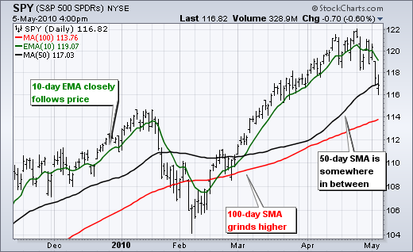
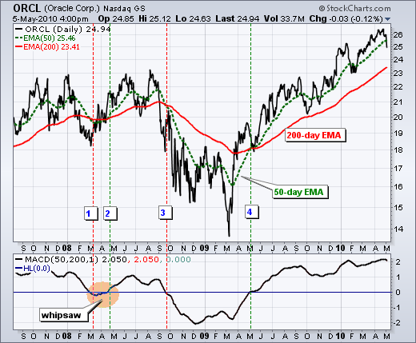
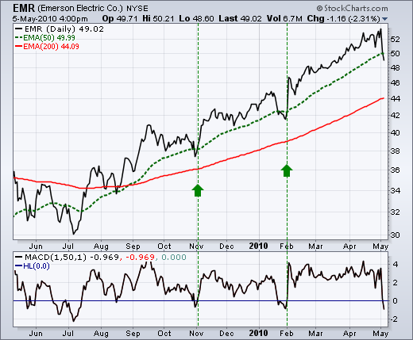
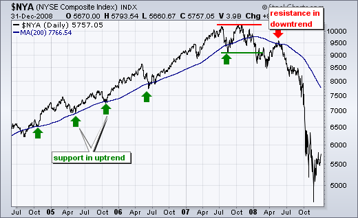

# Moving Averages - Simple and Exponential
[Moving Averages - Simple and Exponential](http://stockcharts.com/school/doku.php?id=chart_school:technical_indicators:moving_averages#simple_vs_exponential_moving_averages)

## Introduction
* Moving averages smooth the price data to form a trend following indicator. They do not predict price direction, but rather define the current direction with a lag. Moving averages lag because they are based on past prices. Despite this lag, moving averages help smooth price action and filter out the noise. They also form the building blocks for many other technical indicators and overlays, such as Bollinger Bands, MACD and the McClellan Oscillator. The two most popular types of moving averages are the Simple Moving Average (SMA) and the Exponential Moving Average (EMA). These moving averages can be used to identify the direction of the trend or define potential support and resistance levels.

* 移动平均线可以平滑价格数据，形成趋势跟踪指标。他们并不预测价格方向，而是用滞后的方式来定义当前的方向。移动平均线之所以滞后，因为它们是基于过去的价格。尽管有这种滞后，移动平均线仍然有助于平稳价格移动和滤除噪音。它们也的构成了许多其他技术指标和覆盖的基石，如Bollinger波段、MACD和McClellan振荡器。最流行的两种移动平均法是简单移动平均法(SMA)和指数移动平均法(EMA)。这些移动平均线可以用来确定趋势的方向或确定潜在的支撑和阻力水平。

#### Here's a chart with both an SMA and an EMA on it:

## Simple Moving Average Calculation
* A simple moving average is formed by computing the average price of a security over a specific number of periods. Most moving averages are based on closing prices. A 5-day simple moving average is the five-day sum of closing prices divided by five. As its name implies, a moving average is an average that moves. Old data is dropped as new data comes available. This causes the average to move along the time scale. Below is an example of a 5-day moving average evolving over three days.

* 简单移动平均(SMA)是通过计算证券在特定时期内的平均价格而形成的。大多数移动均线都是基于收盘价。5天简单移动平均线是5天收盘价总和除以5。顾名思义，移动平均线就是移动的平均线。当新数据可用时，将删除旧数据。这导致平均沿时间尺度移动。下面是一个五天移动平均演变在三天内的例子。

> Daily Closing Prices: 11,12,13,14,15,16,17 First day of 5-day SMA: (11 + 12 + 13 + 14 + 15) / 5 = 13 Second day of 5-day SMA: (12 + 13 + 14 + 15 + 16) / 5 = 14 Third day of 5-day SMA: (13 + 14 + 15 + 16 + 17) / 5 = 15 

* The first day of the moving average simply covers the last five days. The second day of the moving average drops the first data point (11) and adds the new data point (16). The third day of the moving average continues by dropping the first data point (12) and adding the new data point (17). In the example above, prices gradually increase from 11 to 17 over a total of seven days. Notice that the moving average also rises from 13 to 15 over a three-day calculation period. Also, notice that each moving average value is just below the last price. For example, the moving average for day one equals 13 and the last price is 15. Prices the prior four days were lower and this causes the moving average to lag.

## Exponential Moving Average Calculation
* Exponential moving averages (EMAs) reduce the lag by applying more weight to recent prices. The weighting applied to the most recent price depends on the number of periods in the moving average. EMAs differ from simple moving averages in that a given day's EMA calculation depends on the EMA calculations for all the days prior to that day. You need far more than 10 days of data to calculate a reasonably accurate 10-day EMA.

* 指数移动平均线(EMAs)是通过对最近的价格施加更多的权重来减少延迟。对最近价格的加权数取决于移动平均数中的周期数。EMA不同于简单的移动平均值，因为给定一天的EMA计算取决于该天之前的所有天的EMA计算。你需要远超过10天的数据来计算一个合理准确的10天均线。

* There are three steps to calculating an exponential moving average (EMA). First, calculate the simple moving average for the initial EMA value. An exponential moving average (EMA) has to start somewhere, so a simple moving average is used as the previous period's EMA in the first calculation. Second, calculate the weighting multiplier. Third, calculate the exponential moving average for each day between the initial EMA value and today, using the price, the multiplier, and the previous period's EMA value. The formula below is for a 10-day EMA.

* 计算指数移动平均(EMA)有三个步骤。首先，计算初始EMA值的简单移动平均。指数移动平均(EMA)必须从某个地方开始，因此在第一次计算中使用一个简单的移动平均作为前一周期的EMA。第二，计算加权乘数。第三，利用价格、乘数和前一时期的均线值，计算初始均线值到今天的指数移动平均。下面的公式是10天的均线。

> Initial SMA: 10-period sum / 10 Multiplier: (2 / (Time periods + 1) ) = (2 / (10 + 1) ) = 0.1818 (18.18%) EMA: {Close - EMA(previous day)} x multiplier + EMA(previous day) 

## The Weighting Multiplier
* A 10-period exponential moving average applies an 18.18% weighting to the most recent price. A 10-period EMA can also be called an 18.18% EMA. A 20-period EMA applies a 9.52% weighting to the most recent price (2/(20+1) = .0952). Notice that the weighting for the shorter time period is more than the weighting for the longer time period. In fact, the weighting drops by half every time the moving average period doubles.

* 10周期指数移动平均指数对最近的价格适用18.18%的权重。一个10周期的均线也可以称为18.18%均线。20期均线对最近的价格(2/(201)=.0952)适用9.52%的权重。注意，较短时间段的加权要大于较长时间段的加权。事实上，每次移动平均周期加倍时，权重就会下降一半。

* If you want to use a specific percentage for an EMA, you can use this formula to convert it to time periods and then enter that value as the EMA's parameter:

* 如果要对EMA使用特定百分比，可以使用此公式将其转换为时间段，然后输入该值作为EMA的参数：

> Time Period = (2 / Percentage) - 1 3% Example:  Time Period = (2 / 0.03) - 1 = 65.67 time periods 

## EMA Accuracy（精度）
* Below is a spreadsheet example of a 10-day simple moving average and a 10-day exponential moving average for Intel. The SMA calculation is straightforward and requires little explanation: the 10-day SMA simply moves as new prices become available and old prices drop off. The exponential moving average in the spreadsheet starts with the SMA value (22.22) for its first EMA value. After the first calculation, the normal EMA formula is used.

* 下面是一个电子表格的例子，10天简单移动平均和10天指数移动平均英特尔。SMA的计算很简单，几乎不需要解释：10天的SMA只是随着新价格的出现和旧价格的下跌而移动。电子表格中的指数移动平均值以其第一个均线值的sma值(22.22)开始。在第一次计算后，采用了常规的EMA公式。

* The formula for an EMA incorporates the previous period's EMA value, which in turn incorporates the value for the EMA value before that, and so on. Each previous EMA value accounts for a small portion of the current value. Therefore, the current EMA value will change depending on how much past data you use in your EMA calculation. Ideally, for a 100% accurate EMA, you should use every data point the stock has ever had in calculating the EMA, starting your calculations from the first day the stock existed. This is not always practical, but the more data points you use, the more accurate your EMA will be. The goal is to maximize accuracy while minimizing calculation time.

* EMA的公式包含了上一时期的EMA值，而EMA值又包含了之前的EMA值，依此类推。以前的每个EMA值占当前值的一小部分。因此，当前的EMA值将根据您在EMA计算中使用的过去数据的多少而改变。理想情况下，对于100%准确的均线，你应该使用股票在计算均线时所拥有的每一个数据点，从股票存在的第一天开始计算。这并不总是实用的，但是使用的数据点越多，EMA就越准确。目标是最大限度地提高精度，同时最小化计算时间。

* The spreadsheet example below goes back 30 periods. With only 30 data points incorporated in the EMA calculations, the 10-day EMA values in the spreadsheet are not very accurate. On our charts, we calculate back at least 250 periods (typically much further), resulting in EMA values that are accurate to within a fraction of a penny.

* 下面的电子表格示例可以追溯到前30个句点。EMA计算中只有30个数据点，电子表格中10天的EMA值并不十分准确。在我们的图表上，我们计算了至少250个周期(通常更远)，结果是EMA值精确到一个便士的一小部分。

## The Lag Factor

* The longer the moving average, the more the lag. A 10-day exponential moving average will hug prices quite closely and turn shortly after prices turn. Short moving averages are like speedboats - nimble and quick to change. In contrast, a 100-day moving average contains lots of past data that slows it down. Longer moving averages are like ocean tankers - lethargic and slow to change. It takes a larger and longer price movement for a 100-day moving average to change course.

* 移动平均线越长，滞后就越大。10天指数移动平均线会紧紧地拥抱价格，在价格转跌后不久就会回升。短距离移动平均线就像快艇一样--敏捷且变化迅速。相比之下，100天移动平均线包含了许多过去的数据，这些数据使其速度减慢。较长的移动平均线就像海洋油轮——沉闷而缓慢的变化。一个100天的移动平均线需要更大和更长的价格变动才能改变方向。

* The chart above shows the S&P 500 ETF with a 10-day EMA closely following prices and a 100-day SMA grinding higher. Even with the January-February decline, the 100-day SMA held the course and did not turn down. The 50-day SMA fits somewhere between the 10- and 100-day moving averages when it comes to the lag factor.

* 上图显示，标普500ETF的10天均线紧跟随价格，100天形状记忆合金磨削更高。即使在一月到二月的下跌，100天的SMA坚持了这个过程，并没有拒绝.。当谈到滞后因素时，50天的SMA介于10天和100天的移动均线之间。

## Simple vs Exponential Moving Averages
* Even though there are clear differences between simple moving averages and exponential moving averages, one is not necessarily better than the other. Exponential moving averages have less lag and are therefore more sensitive to recent prices - and recent price changes. Exponential moving averages will turn before simple moving averages. Simple moving averages, on the other hand, represent a true average of prices for the entire time period. As such, simple moving averages may be better suited to identify support or resistance levels.

* 尽管简单移动平均线和指数移动平均有明显的区别，但其中一个并不一定比另一个好。指数移动平均线的滞后较小，因此对近期价格和近期价格变化更为敏感。指数移动平均将在简单移动平均线之前发生变化。另一方面，简单的移动平均线代表整个时期的真实平均价格。因此，简单的移动平均线可能更适合于识别支撑或阻力水平。

* Moving average preference depends on objectives, analytical style, and time horizon. Chartists should experiment with both types of moving averages as well as different timeframes to find the best fit. The chart below shows IBM with the 50-day SMA in red and the 50-day EMA in green. Both peaked in late January, but the decline in the EMA was sharper than the decline in the SMA. The EMA turned up in mid-February, but the SMA continued lower until the end of March. Notice that the SMA turned up over a month after the EMA.

* 移动平均偏好取决于目标、分析风格和时间范围。艺术家应该试验两种类型的移动平均线以及不同的时间框架，以找到最佳匹配。下图显示IBM的50天形状记忆合金为红色，50天EMA为绿色.。这两种货币在1月底都达到了顶峰，但EMA的下降比SMA的下降更为剧烈。EMA在2月中旬出现，但SMA一直到3月底才开始走低.。注意，SMA出现在EMA后一个多月。

## Lengths and Timeframes
* The length of the moving average depends on the analytical objectives. Short moving averages (5-20 periods) are best suited for short-term trends and trading. Chartists interested in medium-term trends would opt for longer moving averages that might extend 20-60 periods. Long-term investors will prefer moving averages with 100 or more periods.

* 移动平均的长度取决于分析目标。短期移动平均线(5-20期)最适合短期趋势和交易.。对中期趋势感兴趣的ChArters会选择更长的移动平均线，这可能会延长20-60个时期。长期投资者会更喜欢有100个或更多周期的移动平均线.

* Some moving average lengths are more popular than others. The 200-day moving average is perhaps the most popular. Because of its length, this is clearly a long-term moving average. Next, the 50-day moving average is quite popular for the medium-term trend. Many chartists use the 50-day and 200-day moving averages together. Short-term, a 10-day moving average was quite popular in the past because it was easy to calculate. One simply added the numbers and moved the decimal point.

* 一些移动平均长度比其他移动平均长度更受欢迎。200天移动平均线可能是最受欢迎的。由于它的长度，这显然是一个长期移动平均.。接下来，50天移动平均线在中期趋势中很受欢迎.。许多人物使用50天和200天的移动平均线。短期而言，10天移动平均线在过去相当流行，因为它很容易计算。其中一个简单地添加了数字并移动了小数点。

## Trend Identification
* The same signals can be generated using simple or exponential moving averages. As noted above, the preference depends on each individual. These examples below will use both simple and exponential moving averages. The term “moving average” applies to both simple and exponential moving averages.

* 同样的信号可以用简单的或指数的移动平均值产生。如上所述，偏好取决于每个人。下面的这些例子将使用简单的和指数的移动平均值。“移动平均”一词既适用于简单移动平均，也适用于指数移动平均。

* The direction of the moving average conveys important information about prices. A rising moving average shows that prices are generally increasing. A falling moving average indicates that prices, on average, are falling. A rising long-term moving average reflects a long-term uptrend. A falling long-term moving average reflects a long-term downtrend.

* 移动平均线的方向传达了有关价格的重要信息。上升的移动平均线显示价格普遍在上涨。下跌的移动平均线表明，平均价格正在下降。长期移动均线上升反映了长期上升趋势.。长期移动均线下跌反映了长期下跌趋势。

* The chart above shows 3M (MMM) with a 150-day exponential moving average. This example shows just how well moving averages work when the trend is strong. The 150-day EMA turned down in November 2007 and again in January 2008. Notice that it took a 15% decline to reverse the direction of this moving average. These lagging indicators identify trend reversals as they occur (at best) or after they occur (at worst). MMM continued lower into March 2009 and then surged 40-50%. Notice that the 150-day EMA did not turn up until after this surge. Once it did, however, MMM continued higher the next 12 months. Moving averages work brilliantly in strong trends.

* 上图显示了3M(MMM)公司的150天指数移动平均.。这个例子显示了当趋势很强时移动平均线是如何工作的。为期150天的均线考试在2007年11月和2008年1月又一次被拒绝.。请注意，这一移动平均线的方向发生了15%的下跌。这些滞后指标在发生(最多)或发生后(最坏的情况)时确定趋势逆转。MMM持续下跌至2009年3月，随后上涨40至50%。请注意，150天的均线没有出现，直到这次激增。然而，一旦做到了，MMM在接下来的12个月里继续走高。移动平均线在强劲趋势中发挥了出色的作用。

## Double Crossovers
* Two moving averages can be used together to generate crossover signals. In Technical Analysis of the Financial Markets, John Murphy calls this the “double crossover method”. Double crossovers involve one relatively short moving average and one relatively long moving average. As with all moving averages, the general length of the moving average defines the timeframe for the system. A system using a 5-day EMA and 35-day EMA would be deemed short-term. A system using a 50-day SMA and 200-day SMA would be deemed medium-term, perhaps even long-term.

* 两个移动平均线可以一起用来产生交叉信号。在“金融市场的技术分析”中，约翰·墨菲称这是“双交叉方法”。双交叉包括一个相对较短的移动平均线和一个相对长的移动平均线。与所有移动平均值一样，移动平均值的一般长度定义了系统的时间框架。使用5天均线和35天均线的系统将被认为是短期的.。使用50天SMA和200天SMA的系统将被视为中期，甚至可能是长期的。

* A bullish crossover occurs when the shorter moving average crosses above the longer moving average. This is also known as a golden cross. A bearish crossover occurs when the shorter moving average crosses below the longer moving average. This is known as a dead cross.

* 当较短的移动平均线超过较长的移动平均线时，就会出现看涨的交叉。这也被称为黄金十字架（金叉）。当较短的移动平均线低于较长的移动平均线时，就会出现看跌交叉。这就是所谓的死十字架（死叉）。

* Moving average crossovers produce relatively late signals. After all, the system employs two lagging indicators. The longer the moving average periods, the greater the lag in the signals. These signals work great when a good trend takes hold. However, a moving average crossover system will produce lots of whipsaws in the absence of a strong trend.

* 移动平均交叉产生相对较晚的信号。毕竟，该系统采用了两个滞后指标。移动平均周期越长，信号的滞后就越大。当好的趋势形成时，这些信号就会发挥巨大的作用。然而，在没有强劲趋势的情况下，移动平均交叉系统将产生大量的鞭子。

* There is also a triple crossover method that involves three moving averages. Again, a signal is generated when the shortest moving average crosses the two longer moving averages. A simple triple crossover system might involve 5-day, 10-day, and 20-day moving averages.

* 还有一个三重交叉方法，涉及三个移动平均值。同样，当最短移动平均线与两个较长的移动平均线相交时，会产生信号。一个简单的三重交叉系统可能涉及5天、10天和20天移动平均线。

* The chart above shows Home Depot (HD) with a 10-day EMA (green dotted line) and 50-day EMA (red line). The black line is the daily close. Using a moving average crossover would have resulted in three whipsaws before catching a good trade. The 10-day EMA broke below the 50-day EMA in late October (1), but this did not last long as the 10-day moved back above in mid-November (2). This cross lasted longer, but the next bearish crossover in January (3) occurred near late November price levels, resulting in another whipsaw. This bearish cross did not last long as the 10-day EMA moved back above the 50-day a few days later (4). After three bad signals, the fourth signal foreshadowed a strong move as the stock advanced over 20%.

* 上图显示家得宝(HD)公司有10天的EMA(绿色虚线)和50天的EMA(红线)。黑线是每日的尾声。使用移动平均交叉将导致三鞭子之前抓住一个好的交易。10天均线在10月底跌破了50天的均线(1)，但这并没有持续到11月中旬的10天后才回升(2)。这一交叉交易持续时间较长，但1月(3)的下一次看跌交叉发生在接近11月底的价格水平，导致了另一场震荡。这一熊市交叉并没有持续很长时间，因为10天的均线在几天后又回到50天以上(4)。在经历了三个坏信号之后，第四信号预示着股市将出现强劲的走势，股价上涨超过20%。

* There are two takeaways here. First, crossovers are prone to whipsaw. A price or time filter can be applied to help prevent whipsaws. Traders might require the crossover to last 3 days before acting or require the 10-day EMA to move above/below the 50-day EMA by a certain amount before acting. Second, MACD can be used to identify and quantify these crossovers. MACD (10,50,1) will show a line representing the difference between the two exponential moving averages. MACD turns positive during a golden cross and negative during a dead cross. The Percentage Price Oscillator (PPO) can be used the same way to show percentage differences. Note that MACD and the PPO are based on exponential moving averages and will not match up with simple moving averages.

* 这里有两个提示。首先，交叉易产生鞭锯。价格或时间过滤器可以用来帮助防止鞭子。交易者可能要求交叉操作在行动前持续3天，或要求10天均线在50天均线以上/以下移动一定数量后才能采取行动。第二，MACD可以用来识别和量化这些交叉点。MACD(10，50，1)将显示一条线，表示两个指数移动平均值之间的差值。MACD在金十字时变为正，在死叉时变为负值。百分比价格振荡器(PPO)可以用同样的方式来表示百分比的差异。请注意，MACD和PPO是基于指数移动平均，不会与简单的移动平均线相匹配。

* This chart shows Oracle (ORCL) with the 50-day EMA, 200-day EMA and MACD(50,200,1). There were four moving average crossovers over a 2 1/2 year period. The first three resulted in whipsaws or bad trades. A sustained trend began with the fourth crossover as ORCL advanced to the mid-20s. Once again, moving average crossovers work great when the trend is strong, but produce losses in the absence of a trend.

* 这个图表显示了甲骨文(ORCL)公司的50天EMA，200天EMA和MACD(50，200，1).。在两年半的时间里，有四次移动平均交叉。前三次交易导致了鞭打或坏交易。随着ORCL进入20年代中期，第四次交叉开始了一个持续的趋势。再一次，当趋势强劲时，移动平均线会产生很大的效果，但在没有趋势的情况下会产生损失。

## Price Crossovers
* Moving averages can also be used to generate signals with simple price crossovers. A bullish signal is generated when prices move above the moving average. A bearish signal is generated when prices move below the moving average. Price crossovers can be combined to trade within the bigger trend. The longer moving average sets the tone for the bigger trend and the shorter moving average is used to generate the signals. One would look for bullish price crosses only when prices are already above the longer moving average. This would be trading in harmony with the bigger trend. For example, if price is above the 200-day moving average, chartists would only focus on signals when price moves above the 50-day moving average. Obviously, a move below the 50-day moving average would precede such a signal, but such bearish crosses would be ignored because the bigger trend is up. A bearish cross would simply suggest a pullback within a bigger uptrend. A cross back above the 50-day moving average would signal an upturn in prices and continuation of the bigger uptrend.

* 移动平均线也可以用来生成简单的价格交叉信号。当价格高于移动平均线时，就会产生看涨信号。当价格低于移动平均线时，就会产生看跌信号。价格交叉可以结合起来，在更大的趋势内交易。移动平均时间越长，趋势越大，信号产生的平均时间越短。只有当价格已经高于较长的移动平均线时，人们才会寻找看涨的价格交叉。这将与更大的趋势相协调。例如，如果价格高于200天移动平均线，当价格高于50天移动平均线时，策划师只会关注信号。显然，低于50天移动平均线的走势将先于这样的信号，但这样的看跌交叉将被忽略，因为更大的趋势是上升的。看跌交叉只意味着在更大的上涨趋势内回调。若反弹至50天移动均线上方，将意味着价格上扬，并延续更大的上涨趋势。

* The next chart shows Emerson Electric (EMR) with the 50-day EMA and 200-day EMA. The stock moved above and held above the 200-day moving average in August. There were dips below the 50-day EMA in early November and again in early February. Prices quickly moved back above the 50-day EMA to provide bullish signals (green arrows) in harmony with the bigger uptrend. MACD(1,50,1) is shown in the indicator window to confirm price crosses above or below the 50-day EMA. The 1-day EMA equals the closing price. MACD(1,50,1) is positive when the close is above the 50-day EMA and negative when the close is below the 50-day EMA.

* 下一张图表显示爱默生电气公司(EMR)公司的50天EMA和200天EMA.。8月份，该公司股价在200日移动均线上方移动，并保持在该水平之上.。11月初和2月初，均线指数都低于50天.。价格迅速回到50天均线上方，提供了看涨信号(绿色箭头)，以配合更大的上涨趋势。MACD(1，50，1)显示在指标窗口，以确认价格交叉以上或低于50天均线.。1天均线等于收盘价.。MACD(1，50，1)当收盘高于50天均线时为正，当收盘价低于50天均线时为负值。

## Support and Resistance
* Moving averages can also act as support in an uptrend and resistance in a downtrend. A short-term uptrend might find support near the 20-day simple moving average, which is also used in Bollinger Bands. A long-term uptrend might find support near the 200-day simple moving average, which is the most popular long-term moving average. In fact, the 200-day moving average may offer support or resistance simply because it is so widely used. It is almost like a self-fulfilling prophecy.

* 移动平均线也可以在上升趋势中起到支撑作用，在下行趋势中起到阻力作用。短期上涨趋势可能在20天简单移动均线附近找到支撑，这也适用于Bollinger波段。长期上涨趋势可能在200天简单移动平均线附近找到支撑，这是最受欢迎的长期移动平均线。事实上，200天移动平均线可能提供支撑或阻力，因为它是如此广泛的使用。这几乎就像一个自我实现的预言。

* The chart above shows the NY Composite with the 200-day simple moving average from mid-2004 until the end of 2008. The 200-day provided support numerous times during the advance. Once the trend reversed with a double top support break, the 200-day moving average acted as resistance around 9500.

* 上图显示纽约综合指数2004年年中至2008年底有200天简单移动平均线。在前进过程中，200天提供了多次支援。一旦趋势逆转，双顶支撑突破，200天移动平均线作为阻力在9500左右。

* Do not expect exact support and resistance levels from moving averages, especially longer moving averages. Markets are driven by emotion, which makes them prone to overshoots. Instead of exact levels, moving averages can be used to identify support or resistance zones.

* 不要期望移动平均线的精确支撑和阻力水平，特别是较长的移动平均线。市场是受情绪驱动的，这使他们容易过度。移动平均线可以用来识别支撑区或阻力区，而不是精确的水平。

## Conclusions
* The advantages of using moving averages need to be weighed against the disadvantages. Moving averages are trend following, or lagging, indicators that will always be a step behind. This is not necessarily a bad thing though. After all, the trend is your friend and it is best to trade in the direction of the trend. Moving averages ensure that a trader is in line with the current trend. Even though the trend is your friend, securities spend a great deal of time in trading ranges, which render moving averages ineffective. Once in a trend, moving averages will keep you in, but also give late signals. Don't expect to sell at the top and buy at the bottom using moving averages. As with most technical analysis tools, moving averages should not be used on their own, but in conjunction with other complementary tools. Chartists can use moving averages to define the overall trend and then use RSI to define overbought or oversold levels.

* 使用移动平均线的优点需要与缺点进行权衡。移动平均线是趋势跟踪指标，或者说是滞后指标，总是落后一步。不过，这不一定是坏事。毕竟，趋势是你的朋友，最好朝趋势的方向去交易。移动平均线确保交易者与当前趋势一致。尽管趋势是你的朋友，证券花费了大量的时间在交易区间，这使得移动平均线无效。一旦进入一个趋势，移动平均线会让你继续前进，但也会给出迟来的信号。不要指望在顶部卖出，在底部用移动平均线买入。与大多数技术分析工具一样，不应单独使用移动平均数，而应与其他补充工具结合使用。创作者可以使用移动平均线来定义总体趋势，然后使用RSI来定义超买或超卖水平。

## Further Study
* John Murphy's book has a chapter devoted to moving averages and their various uses. Murphy covers the pros and cons of moving averages. In addition, Murphy shows how moving averages work with Bollinger Bands and channel-based trading systems.

* 约翰墨菲的书有一章专门讨论移动平均线及其各种用途。墨菲介绍了移动平均法的利弊。此外，墨菲展示了移动平均线如何与Bollinger波段和基于渠道的交易系统一起工作。
